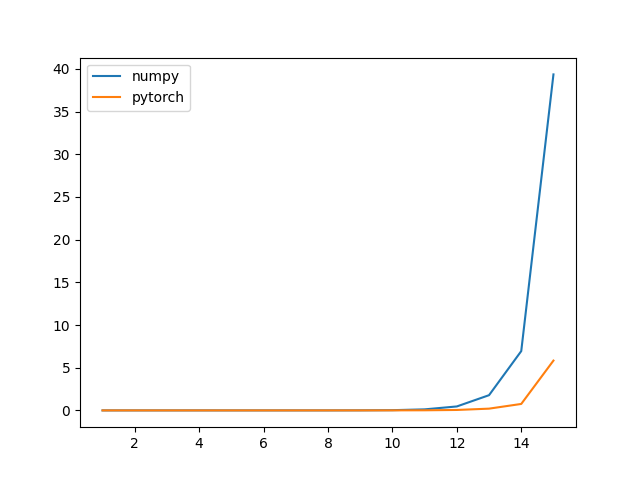
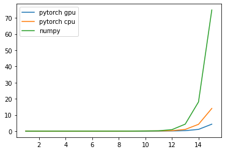

**Quself 속도 개선에 대한 솔루션**

**기존 문제점**

- 크로네커 곱 (Kronecker Product)에 대한 **계산량**이 큐비트가 늘어날 수록 지수적으로 증가
  - 최대 12큐비트까지 안정적으로 시뮬레이션 가능했다.
- 크로네커 곱 (Kronecker Product)에 대한 **메모리**가 큐비트가 늘어날 수록 지수적으로 증가

**해결 방안**

- numpy에서 pytorch로 교체
- 가상 메모리 할당을 통한 메모리 확보
- gpu 가속화 사용

**실험 결과**

- 크로네커 곱에 있어 numpy와 pytorch의 속도 비교
  - 파이토치의가 넘파이보다 크로네커 곱에 있어 월등히 높은 효율을 보이고 있는 것을 확인 했다

- 행렬 곱에 있어 numpy와 pytorch의 속도 비교
  - 행렬 곱에 있어서는 두 라이브러리 및 프레임워크 사이의 큰 성능 차이를 확인 하지 못함(15큐비트 기준)
- 결론 -> 크로네커 곱에 있어 효율적으로 계산 시간을 줄여주고 gpu 사용을 지원하는 파이토치로 교체 결정

**테스트 결과**

- 각각 pytorch gpu, pytorch cpu, numpy 기반의 quself를 이용해 1큐비트 부터 15 큐비트까지 생성 및 하다마드 게이트 적용까지 걸리는 시간을 체크 해보았을 때 당연하게도 pytorch gpu 기반의 quself가 제일 좋은 성능을 보임. 이는 numpy 기반의 엔진에 비해 매우 효율적으로 속도 개선이 이루어 진것을 의미함.